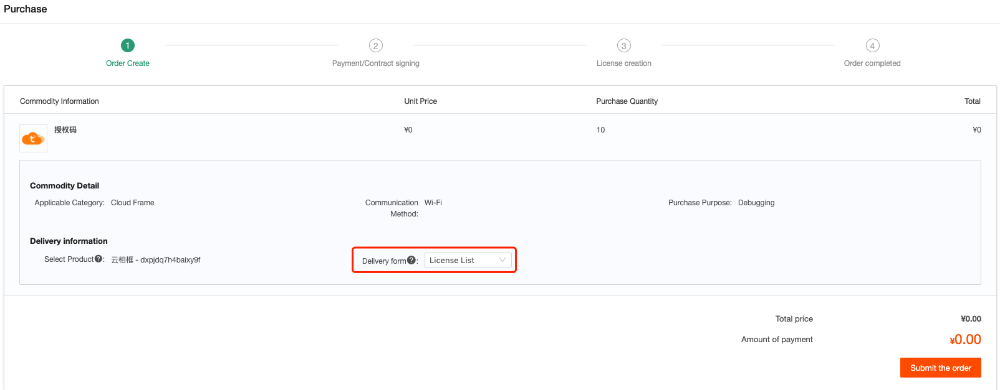
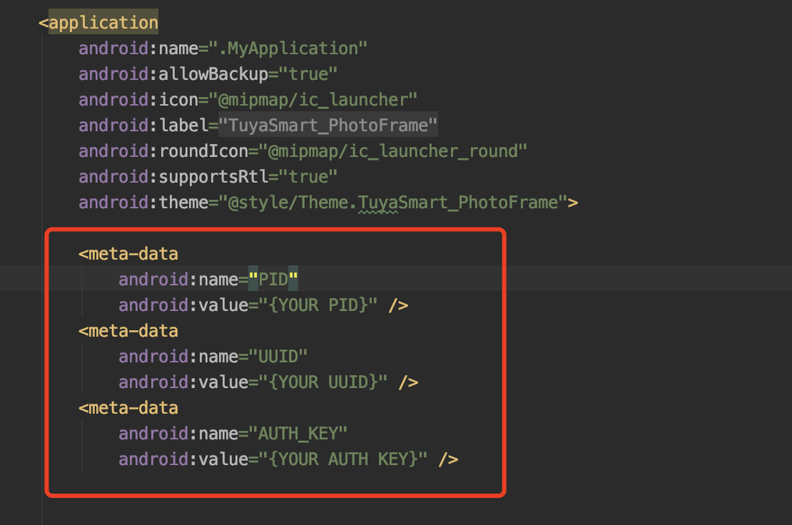

# tuya-iotos-android-photo-frame-demo

[中文文档](README-zh.md) | English

Tuya Photo Frame SDK Android Demo

## Features Overview

Tuya Photo Frame SDK is developed based on [Tuya Android IoT SDK](https://github.com/tuya/tuya-iotos-android-iot-demo) and has the ability to obtain cloud image and video, cloud image and video download and cloud storage capacity. Minimum support Android API version 19.

## Preparation for Integration

### 1. Register Tuya Developer Account

Go to the [ Tuya Smart Development Platform](https://iot.tuya.com/) to register a developer account。

### 2. Create Cloud Frame Category products to get pid,uuid and key.

#### 2.1 Click Create Product-Entertainment-Cloud Frame, complete the product information, and then click the Create Product button.

#### 2.2 Enter the third step of Hardware Development, choose the docking plan and corresponding SDK, then get 10 free Licenses.

#### 2.3 Choose 'Delivery from' License List , and then click Submit the order button.


## Demo App

Demo App mainly demonstrates the API functions of Tuya Photo Frame SDK, which generally includes device activation,
File list display, file download, cloud capacity acquisition and device unbinding and other functions.


Use Android Stuido open demo project, Set pid, uuid and key in the `AndroidManifest.xml` file.



Then run Demo App to see the following effects

 
 


## Integrate SDK

### 1. Create Project

Build your project in the Android Studio.

### 2. Configure the build.gradle

Add the following codes to the build.gradle file in the project root directory.

```groovy
allprojects {
    repositories {
        google()
        jcenter()
        maven { url 'https://dl.bintray.com/tuyasmartai/sdk' }
    }
}
```
Add the following codes to the build.gradle file in app module.

```groovy
android {
    defaultConfig {
        ndk {
            abiFilters "armeabi-v7a"
        }
    }
    packagingOptions {
        pickFirst 'lib/armeabi-v7a/libc++_shared.so' // multiple aar exist for this so, need to pick the first one
    }
}
dependencies {
    implementation 'com.tuya.smart:photo-frame:1.0.0'

    // tuya iot_sdk denpendencies
    implementation 'com.tuya.smart:tuyasmart-iot_sdk:1.1.0' 
    implementation 'com.tencent.mars:mars-xlog:1.2.3'
}
```
> Tips： </br> Since the Tuya Photo Frame SDK is based on the Tuya Android IoT SDK capabilities, you need to include the Tuya Android IoT SDK dependencies. For more information on the features of the Tuya Android IoT SDK, go to [GitHub](https://github.com/tuya/tuya-iotos-android-iot-demo) to check it out.

### 3. Permission configuration

```xml
<uses-permission android:name="android.permission.INTERNET" />
```

### 4. Proguard configuration

```
-keep class com.tuya.smart.android.photoframe.**{*;}
-dontwarn com.tuya.smart.android.photoframe.**
-keep class com.tuya.smartai.iot_sdk.** {*;}
-keep class com.tencent.mars.** {*;}
```
### 5. Initialize the SDK

Initialize the configuration in the Application.

```
 TuyaPhotoFrame.getInstance()
                .setIoTManager(IoTSDKManager ioTSDKManager) //Must be set! It is recommended to maintain a single instance of IoTSDKManager 
                .init(this);
```

## SDK API

### Get cloud storage capacity

</br>

**Get the cloud storage capacity using the following api**
```java
TuyaPhotoFrame.newRequest().getCapacity(String deviceId , ITuyaResultCallback<Capacity> callback);
```

**Parameter description**

| Parameter    | Description      |
| ---- | ---- |
| deviceId | Device id, obtained by getDeviceId() function of IoTSDKManager |
| callback   | callback |

</br>

**Sample code**


```java
TuyaPhotoFrame.newRequest().getCapacity("deviceId", new ITuyaResultCallback<Capacity>() {
    
            @Override
            public void onSuccess(Capacity capacity) {
                
            }

            @Override
            public void onError(String errorCode, String errorMessage) {

            }
        });
```
**Capacity Field properties**

Field Name | Type | Remarks
:-|:-:|:-:|:-
totalCapacity | long  | Total cloud storage capacity held by users.
usedCapacity | long  | Cloud storage capacity that users have used.
imageUsedCapacity | long  | Image of cloud storage capacity that users have used.
videoUsedCapacity | long  | Video of cloud storage capacity that users have used.

</br>

### Get a list of all types of files

</br>

**Get a list of types of files using the following api**
```java
TuyaPhotoFrame.newRequest().getUploadedFileList(int limit , int offset , int width , int height , ITuyaResultCallback<PageInfo> callback);
```

**Parameter Description**

| Parameter    | description          |
| ---- | ---- |
| limit | Maximum number of items at a time |
| offset   | offset |
| width   | width of the thumbnail |
| height   |  height of thumbnail |

</br>

**Sample code**

```java
TuyaPhotoFrame.newRequest().getUploadedFileList(20, 0, 400, 400, new ITuyaResultCallback<PageInfo>() {

            @Override
            public void onSuccess(PageInfo pageInfo) {
                
            }

            @Override
            public void onError(String errorCode, String errorMessage) {

            }
        });
```
**PageInfo field properties**

Field Name | Type | Remarks
:-|:-:|:-:|:-
offset | int  | offset
hasNext | boolean  | whether there is a next page
totalCount | long  |  totalCount
datas | List<DateInfo>  |  List of dates, see the `DateInfo` field properties

</br>

**DateInfo field properties**

Field Name | Type | Remarks
:-|:-:|:-:|:-
date | long  | Timestamp of the upload
list | List  | List of files, see the `FileInfo` field properties

</br>

**FileInfo field properties**

Field Name | Type | Remarks
:-|:-:|:-:|:-
devId | String  | device id
size | long  | file size
id | long  | file id
type | String  |  File type: "image", "video"
title | long  | title of the file
duration | long  |  The duration of the video, valid only when type is "video".
fileUrl | long  | Thumbnail url

</br>

### Get a list of files of the specified type

</br>

**Get a list of files of the specified type using the following api**
```java
TuyaPhotoFrame.newRequest().getUploadedFileListWithType(int limit , int offset , int width , int height , String type , ITuyaResultCallback<PageInfo> callback);
```

**Parameter description**

| Parameter    | description          |
| ---- | ---- |
| limit | Maximum number of items at a time |
| offset   | offset |
| width   | width of the thumbnail |
| height   |  height of thumbnail |
| type   | File type: "image" or "video"  |

</br>

**Sample code**

```java
// Request Image List
TuyaPhotoFrame.newRequest().getUploadedFileListWithType(20, 0, 400, 400, "image", new ITuyaResultCallback<PageInfo>() {

            @Override
            public void onSuccess(PageInfo pageInfo) {
                
            }

            @Override
            public void onError(String errorCode, String errorMessage) {

            }
        });

// Request Video List
TuyaPhotoFrame.newRequest().getUploadedFileListWithType(20, 0, 400, 400, "video", new ITuyaResultCallback<PageInfo>() {

            @Override
            public void onSuccess(PageInfo pageInfo) {
                
            }

            @Override
            public void onError(String errorCode, String errorMessage) {

            }
        });
```

### Download the file

</br>

**Use the following api to download files**

```java
TuyaPhotoFrame.newRequest().getDownload(long id, String downloadPath, String type);
```

**Parameter description**

| Parameter | Description |
| ---- | ---- |
| id | File id |
| downloadPath   | The download path. If it is not an application-specific path, you need to apply for read/write permission by yourself, you can refer to [Data and file storage overview](https://developer.android.google.cn/training/data-storage#scoped-storage)|
| type   |  File types："image","video" |

</br>


**Sample code**

```java
public class DownloadActivity extends AppCompatActivity {

    BroadcastReceiver mReceiver = new BroadcastReceiver() {
        @Override
        public void onReceive(Context context, Intent intent) {
            if (intent.getAction().equals(ISchedulers.PHOTO_FRAME_DOWNLOAD_INFO_ACTION)) {
                int state = intent.getIntExtra(ISchedulers.DOWNLOAD_STATE, -1);
                switch (state) {
                    // Start downloading
                    case ISchedulers.START:
                        int taskId = intent.getIntExtra(ISchedulers.DOWNLOAD_TASK_ID, -1);
                        // taskId is the file id
                        Log.d("DownloadActivity", "taskId: "+taskId);
                        break;
                    // Downloading
                    case ISchedulers.RUNNING:
                        long progress = intent.getLongExtra(ISchedulers.DOWNLOAD_PROGRESS, -1);
                        long totalSize = intent.getLongExtra(ISchedulers.DOWNLOAD_TOTAL_SIZE, -1);
                        // Download progress and file size
                        Log.d("DownloadActivity", "progress: " + progress + ", totalSize: " + totalSize);
                        break;
                    //Download completed
                    case ISchedulers.COMPLETE:
                        String filePath = intent.getStringExtra(ISchedulers.DOWNLOAD_COMPLETE_PATH);
                        // File path after download is complete
                        Log.d("DownloadActivity", "filePath: " + filePath);
                        break;
                    // Download failed
                    case ISchedulers.ERROR:
                        String errorCode = intent.getStringExtra(ISchedulers.DOWNLOAD_ERROR_CODE);
                        String errorMessage = intent.getStringExtra(ISchedulers.DOWNLOAD_ERROR_MESSAGE);
                        // Error code and error message for download failure
                        Toast.makeText(context, "errorCode: " + errorCode + " ,errorMessage: " + errorMessage, Toast.LENGTH_SHORT).show();
                        break;
                    default:
                        break;
                }
            }
        }
    };

    @Override
    protected void onCreate(@Nullable Bundle savedInstanceState) {
        super.onCreate(savedInstanceState);
        setContentView(R.layout.activity_download);

          // If you need to get the download-related state, please registerReceiver
        registerReceiver(mReceiver, new IntentFilter(ISchedulers.PHOTO_FRAME_DOWNLOAD_INFO_ACTION));

        TuyaPhotoFrame.newRequest().getDownload(id,getExternalFilesDir(""),"video");
    }

    @Override
    protected void onDestroy() {
        super.onDestroy();
        // If you register a broadcast, be sure to remember to unregisterRecevier
        if (mReceiver != null) {
            unregisterReceiver(mReceiver);
        }
    }
}
```

- Get download task information

| Field Name | Description | Use |
| ---- | ---- | ---- |
| ISchedulers.PHOTO_FRAME_DOWNLOAD_INFO_ACTION | Broadcast receiver Action, used to register a broadcast  | 
| ISchedulers.DOWNLOAD_STATE |  Get task status   |  int type, see the following table for task status |
| ISchedulers.DOWNLOAD_TASK_ID | Get task id  |  int type |
| ISchedulers.DOWNLOAD_COMPLETE_PATH | Get the path where the download is completed  | String type, only available in ISchedulers.COMPLETE |
| ISchedulers.DOWNLOAD_PROGRESS | Get the download progress  |  long type, 0-100, can only be retrieved in ISchedulers.RUNNING |
| ISchedulers.DOWNLOAD_TOTAL_SIZE | Get file size  |  long type, only available in ISchedulers.RUNNING |
| ISchedulers.DOWNLOAD_ERROR_CODE |  Get error code   | String type, only available in ISchedulers.ERROR |
| ISchedulers.DOWNLOAD_ERROR_MESSAGE | Get error message | String type, can only be fetched in ISchedulers.ERROR  | 

</br>

- Task Status

| Field Name | Value | Description |
| ---- | ---- | ---- |
| ISchedulers.START | 0 |  Task Start |
| ISchedulers.RUNNING | 1  | Task in progress |
| ISchedulers.COMPLETE | 2  | Task completed |
| ISchedulers.ERROR | 3  | Task failed |

</br>

### Cancel download

</br>

```java
TuyaPhotoFrame.newRequest().cancelDownload(long id);
```


**Parameter description**


| Parameter | Description |
| ---- | ---- |
| id | File id |


</br>


## Error Code

| error code | Description |
| ---- | ---- |
| -6656 | disconnected with router |
| -6657 | device not bind |
| -4354 | fill url full error |
| -4362 | receiver err |
| -4366 | api token expire |
| -4372 | api version wrong |
| -4373 | device removed |
| -4374 | device already bind |
| -4375 | remote api run unKnow failed |
| -4376 | format string failed |
| -4378 | service verify failed |
|-2049 | http url param out limit |
|-2050 | http os error |
|-2051 | http prepare request error |
|-2052 | http send request error |
|-2053 | http read error |
|-2054 | http add head error |
|-2055 | http get response error |
|-2060 | create http url head error |
|-2061 | https handle fail |
|-2062 | https response unValid |
|-2063 | no support range |
| 3001 | json parse error |
| 3100 | other error |

## ChangeLog
[CHANGELOG.md](CHANGELOG.md)

## Support

You can get support from Tuya with the following methods:

Tuya Smart Help Center: https://support.tuya.com/en/help

Technical Support Council: https://service.console.tuya.com

## License

This Tuya Photo Frame SDK is licensed under the MIT License.
